*By James Yang and Anjan Dave*

---

This post is written for solutions architects and technical leaders evaluating multi-agent architectures. The post assumes familiarity with large language models (LLMs), tool use, and single-agent design. The guidance focuses on architectural trade-offs, production considerations, and pattern selection, not introductory concepts.

As organizations move from single-agent prototypes to production systems, the challenge shifts from "can an agent solve a task?" to "how do you coordinate many specialized agents to solve complex problems reliably?" Some examples include a Human Capital Management (HCM) payroll system orchestrating more than 30 domain-specific sub-agents across benefits, tax, and compliance workflows. A network management system where supervisor agents perform root cause analysis and remediation actions across events collected by dozens of monitoring sub-agents for millions of devices deployed globally. A DevOps agent system where humans and AI collaborate on troubleshooting and remediation. These real-world scenarios demand deliberate architectural choices about how agents communicate, delegate, and collaborate.

In this post, you learn:

- How to select from eight orchestration patterns using a decision flowchart
- Where each pattern fits, and where it doesn't, with trade-offs and anti-patterns
- How router, hierarchical, and graph-based patterns differ in routing strategy, with detailed design considerations for each
- How team-of-agents and dynamic worker pool patterns address gaps in existing approaches
- How progressive disclosure scales tool discovery without scaling costs

*The code examples in this post use the open source [Strands Agents SDK](https://strandsagents.com/) to illustrate each pattern. The pattern concepts and decision guidance are framework-agnostic and apply regardless of your multi-agent implementation.*

> **Note:** *Supervisor* and *sub-agent* are roles within patterns, not patterns themselves. A supervisor (also called orchestrator) is the agent that classifies, delegates, or decomposes work. The supervisor role appears in the router (classify and dispatch), hierarchical (decompose, delegate, synthesize), and dynamic worker pool (runtime-scaled delegation) patterns. A sub-agent is an agent that receives delegated work. The team-of-agents pattern has no supervisor; peers hand off to each other. Sequential, parallel, broadcast, and graph-based patterns use structural coordination defined by the developer, not agent-driven supervision.

These eight patterns range from fully deterministic to fully model-driven. Deterministic patterns give you predictable, auditable, and cost-efficient execution -- the developer defines paths, conditions, and control flow at design time. Prefer these when the task structure is known in advance. Model-driven patterns add flexibility when the task genuinely requires runtime reasoning, with the LLM deciding routing, decomposition, or handoffs. The trade-off is higher cost and less predictable behavior. Most production systems combine both: deterministic coordination for the predictable parts, model-driven orchestration for the parts that require reasoning.

## Which pattern should you use?

The following overview and decision flowchart introduce the eight patterns visually. Use the decision matrix and comparison table below them to identify your starting point, then read the corresponding pattern section.

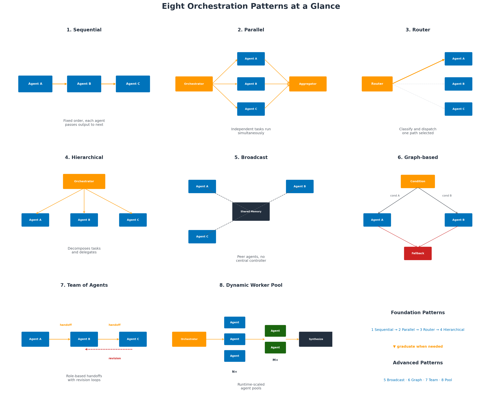
*Figure 1: Eight orchestration patterns at a glance.*

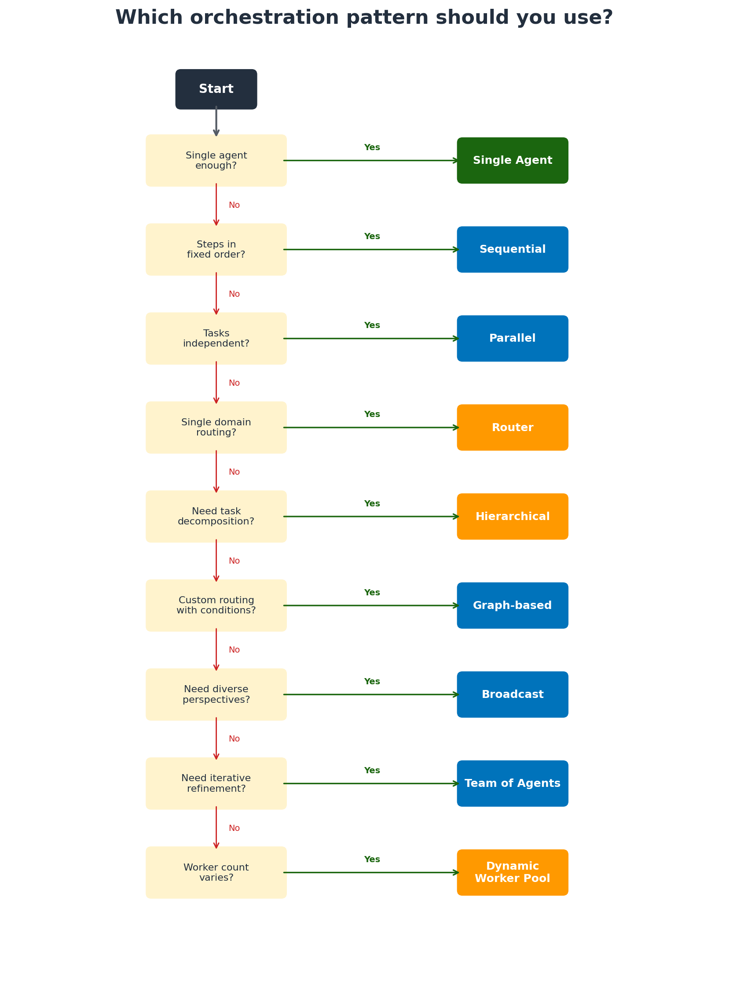
*Figure 2: Decision flowchart covering all eight patterns. Follow the questions to identify the right pattern for your workflow.*

| If your workflow needs... | Use this pattern | Start here if... | Anti-pattern (don't use when) |
|--------------------------|-----------------|------------------|-------------------------------|
| Fixed step-by-step processing | Sequential | Steps always run in the same order | Steps can run independently; use parallel instead |
| Independent tasks run at the same time | Parallel | Tasks don't depend on each other | Tasks have ordering dependencies; use sequential |
| Single-domain classification and dispatch | Router | Queries map cleanly to one domain | Queries span multiple domains; use hierarchical |
| Diverse perspectives on the same problem | Broadcast | Quality improves with multiple viewpoints | You need deterministic, reproducible results |
| Central task decomposition and delegation | Hierarchical | You need cross-domain coordination | Simple single-domain routing; use router instead |
| Custom routing with conditional branching | Graph-based | You need explicit control over information flow | Simple linear workflows; overhead isn't justified |
| Role-based collaboration with handoffs | Team of agents | The task has distinct phases requiring different expertise | First agent's output is good enough without review |
| Runtime-determined team size per role | Dynamic worker pool | The number of workers depends on the task | Team composition is always the same; use static team |

### Pattern comparison at a glance

| Pattern | Sample use cases | Relative latency | Token cost multiplier | Failure risk | Implementation complexity |
|---------|-----------------|------------------|-----------------------|--------------|--------------------------|
| Sequential | Financial compliance approval, order processing | Linear (sum of stages) | 1x per stage | Low; easy to retry individual stages | Low |
| Parallel | Multi-source research, batch analysis | Constant (slowest branch) | 1x per branch (parallel) | Medium; partial failures need handling | Medium |
| Router | Help desk triage, FAQ routing | Low (classify + 1 agent) | ~2x (router + specialist) | Low; misroute is primary risk | Low |
| Broadcast | Code review, investment analysis | Constant (agents run in parallel) | Nx (one per perspective) | Low; independent agents | Medium |
| Hierarchical | Human Capital Management (HCM) system, cross-domain workflows | Medium (orchestrator + N agents) | 3-5x (orchestrator + sub-agents + synthesis) | Medium; orchestrator is single point of failure | Medium-High |
| Graph-based | Approval workflows, iterative refinement | Variable (depends on path taken) | 2-10x (depends on loops/branches) | Medium; complex state management | High |
| Team of agents | Content creation, design review | Linear (handoffs x iterations) | Proportional to handoff count | Medium; infinite loop risk | Medium |
| Dynamic worker pool | Multi-file code changes, parallel testing | Constant (slowest worker) + overhead | Nx workers + orchestrator overhead | High; merge conflicts, decomposition errors | High |

**The graduation path:** Start with a single agent. When routing accuracy drops because one agent handles too many domains, consider router. When queries require decomposition across multiple domains, consider hierarchical. When quality improves through iterative peer review, consider team-of-agents. When the number of workers varies per task, consider dynamic worker pool. When you need explicit, auditable control flow with conditional branching, consider graph-based.

## Foundation patterns (1-4)

Patterns 1 through 4 are well-established building blocks covered extensively in existing multi-agent literature. Patterns 1-2 (sequential, parallel) are summarized briefly. Patterns 3-4 (router, hierarchical), the most commonly evaluated patterns for enterprise architectures, receive detailed design guidance.

**Pattern 1: Sequential (pipeline)** -- Agents chained in fixed order. Each passes output to the next. Simplest to implement and debug. Latency scales linearly with stages. Use when steps always run in the same sequence.

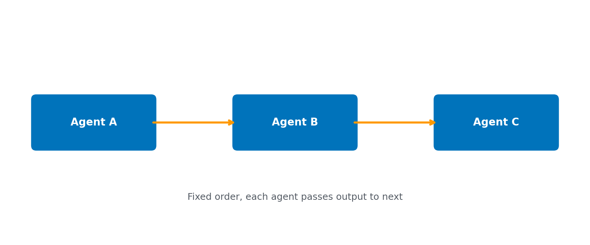

**Pattern 2: Parallel (fan-out/fan-in)** -- Independent subtasks run simultaneously, then an aggregator combines results. The developer defines a fixed set of sub-tasks at design time; each worker runs independently, and results are merged when the workers return. The aggregator merges results without reasoning about them. The hierarchical pattern, by contrast, uses an LLM to decompose requests into sub-tasks at runtime. In the HCM domain, an example is fanning out to different domain APIs simultaneously to populate a "My HR Summary" page. Latency equals the slowest subtask. Use when tasks don't depend on each other. Watch out for result reconciliation complexity.

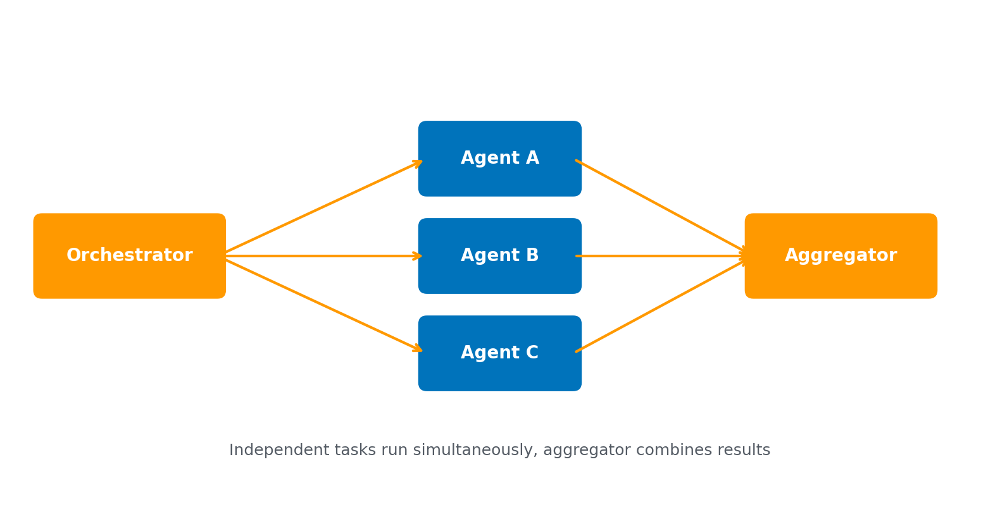

### Pattern 3: Router

<!-- //anjan-start: Router (P3) — do not modify content -->

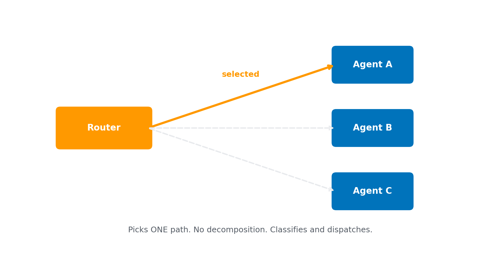

The router pattern is typical in enterprise environments where different sub-agents are designated to perform distinct tasks based on the input. A router agent acts as a single classifier component to analyze incoming requests and direct execution to a specialized agent based on known input conditions. The router pattern works well when there are distinct categories of work that each sub-agent can handle separately. There is no decomposition of the tasks by the router; it classifies and dispatches, nothing more.

**Use this when:** The majority of user queries map cleanly to a single domain. You want low latency and simplicity, and each domain is self-sufficient (meaning it can produce a complete answer on its own). You don't need cross-domain coordination for most requests.

**Don't use this when:** Queries frequently span multiple domains requiring coordination (use hierarchical instead). The router pattern cannot decompose a query into sub-tasks; it can only send the entire query to one destination.

#### Key design considerations

**Router classification strategy:** Since the router is the most critical component, there are typically three approaches:

1. **LLM-based routing** -- Prompt an LLM with intent descriptions plus the user query and return the target agent. LLM routing handles ambiguity well but adds latency and cost to every request.
2. **Embedding + similarity** -- Embed the query, compare to pre-computed route embeddings, and pick the nearest match. Fast and cheap with no LLM call required, but can struggle with ambiguous or overlapping intents.
3. **Rule-based routing** -- Keyword or regex matching, not based on semantic meaning. Very fast with no LLM call, but brittle and cannot handle paraphrasing.

**Handling ambiguity:** If the router's confidence is below a threshold, ask the user to clarify rather than routing incorrectly. Have a fallback route that can handle general-purpose queries like FAQs.

**Route definitions:** Have the router use accurate descriptions to handle specific domain queries to make its classification decision. Use example phrases like "how many vacation days do I have," "what is my PTO balance," "I need time off next Friday" to route to a `pto_agent`, for example.

**Statelessness:** The router should be stateless. The router should not maintain conversation history or session context. If needed, have a separate session state layer upstream of the router or a state managed by the downstream agent.

<!-- //anjan-end: Router (P3) -->

To illustrate LLM-based routing in the HCM domain: the router sends the employee query and descriptions of five domain agents to an LLM. The five agents are Pay Profile, Benefits Advisor, Scheduling, Time & Attendance, and PTO Coordinator. The LLM returns the target agent. For example, "What happens to my paycheck when I'm on leave?" is ambiguous -- it could be Pay Profile or PTO. The LLM correctly routes to Pay Profile because the question is about compensation impact, not leave balance. HR queries often cross system boundaries that employees don't think about. LLM-based routing handles this natural ambiguity at the cost of an additional LLM call per request.

### Pattern 4: Hierarchical (orchestrator/agent)

<!-- //anjan-start: Hierarchical (P4) — do not modify content -->

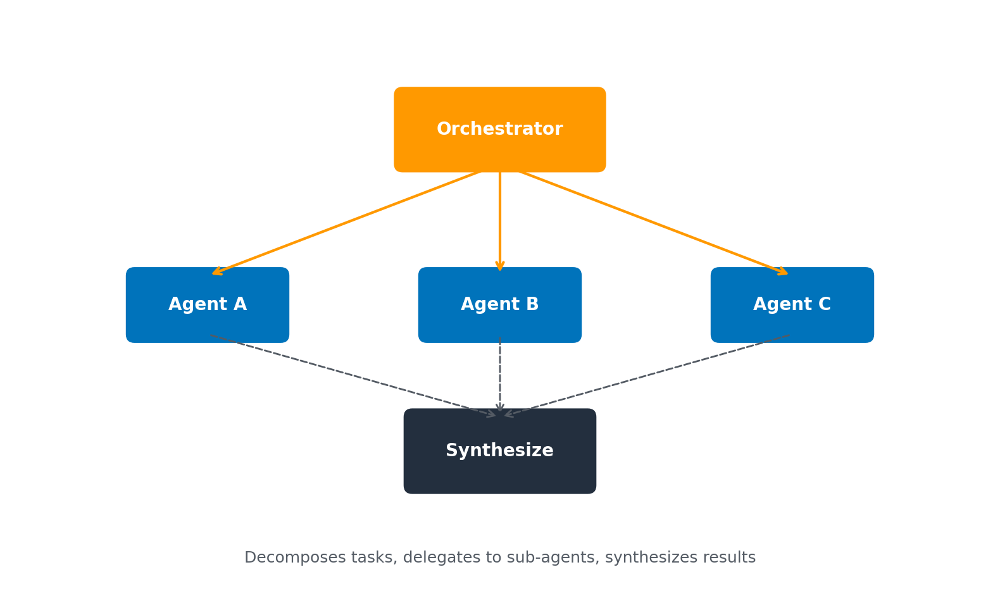

An orchestrator uses LLM reasoning to classify the request and select which agent to delegate to (model-driven routing). The hierarchical pattern is commonly used across many enterprise workflows, hence described in more detail.

A single central agent (the orchestrator) receives user requests, decomposes them into sub-tasks, delegates to specialized sub-agents, and synthesizes a unified response. The hierarchical pattern is distinct from simpler patterns like sequential chains or routers because the orchestrator maintains global context, handles cross-domain coordination, and can fan-out to multiple agents in parallel.

**Use this when:** Requests span multiple domains and require decomposition, parallel execution of sub-tasks, and synthesized responses. The orchestrator adds value when it needs to reason about dependencies between sub-tasks.

**Don't use this when:** Queries map cleanly to a single domain; use the router pattern instead. The orchestrator overhead (additional LLM call for planning, context management, synthesis) isn't justified for simple dispatch.

**The orchestrator is an LLM-powered agent**, not a rules engine or code-based router. The orchestrator uses model reasoning to decompose requests, plan execution order, and synthesize results. Model-driven reasoning is what distinguishes the orchestrator from the router (which classifies but doesn't decompose) and the graph-based pattern (which uses developer-defined conditions, not model reasoning).

#### Key design considerations

The orchestrator agent does more than just routing. Using Human Capital Management (HCM) as an example, assume the orchestrator manages five sub-domains through sub-agents: Payroll, Benefits, Scheduling, Time & Attendance, and PTO Coordinator. With this example, the key design considerations are:

**Intent classification and decomposition:** Parse the user's request, identify which domains are involved, and break it into sub-tasks. A query like "I'm going on parental leave, what happens to my pay and benefits?" becomes three sub-tasks: PTO (leave request), Pay Profile (pay continuation/short-term disability), Benefits (coverage during leave).

**Execution planning:** Determine dependency order. Some sub-tasks can run in parallel (PTO balance check + schedule check), while others are sequential (must confirm PTO approval before updating the schedule).

**Result aggregation and conflict resolution:** Combine sub-agent responses into a coherent answer. Handle contradictions, for example, PTO agent says "approved," but the Scheduling agent says "critical coverage gap."

**Conversation memory:** Maintain multi-turn context so the user doesn't have to repeat their previous questions. The orchestrator owns the session state, not the sub-agents.

#### Additional planning considerations

- **Sub-agent autonomy versus control** -- Carefully choose tight versus loose autonomy. Does the orchestrator dictate exact tool calls, or does the sub-agent decide how to fulfill the task? Consider how error handling is managed and whether the orchestrator owns the state of the sub-agents.
- **Communication patterns** -- Synchronous request-reply (orchestrator calls sub-agents and waits for a response), asynchronous event-driven with status polling, or hybrid (synchronous for interactive queries with < 5 second SLA).
- **Context passing strategy** -- What context (full conversation history, user identity, sub-agent responses, business rules and policies) does the orchestrator share with sub-agents? Context scope is critical for both correctness and security. Minimal context reduces token cost and latency.
- **Error handling** -- Sub-agent timeouts, retry logic, grounding sub-agents to tool usage over generation, cross-validation of responses, orchestrator misroutes.
- **Security and compliance** -- Orchestrator enforcement of Role-Based Access Control (RBAC) verifying that an employee can view only their data, data isolation between sub-agents, audit trail for each sub-agent action, handling PII and guardrails.
- **State management** -- Conversation and task state (owned by orchestrator) and domain state (owned by sub-agents).
- **Scalability** -- Each sub-agent should be independently deployable and scalable, with the orchestrator not becoming a bottleneck. Create token budgets per sub-agent call and summarize long responses. Cache frequently asked questions at the sub-agent level.
- **Human-in-the-loop (HITL)** -- Review which actions are auto-approved versus requiring human approval workflows or manager overrides, based on intent.

Scales well: adding a domain means adding a `@tool` function. At enterprise scale, this evolves into a super orchestrator with dynamic agent generation (the [Arbiter pattern](https://aws.amazon.com/blogs/devops/multi-agent-collaboration-with-strands/)).

In Strands Agents, each sub-agent is registered as a `@tool` function that the orchestrator invokes through standard tool calling:

```python
from strands import Agent
from strands import tool

@tool
def payroll_agent(query: str) -> str:
    """Handle payroll calculations, salary adjustments, and pay schedules."""
    agent = Agent(
        system_prompt="You are a payroll domain expert.",
        tools=[payroll_db_lookup, salary_calculator, tax_withholding]
    )
    return str(agent(query))

@tool
def benefits_agent(query: str) -> str:
    """Handle benefits enrollment, changes, and eligibility."""
    agent = Agent(
        system_prompt="You are a benefits domain expert.",
        tools=[benefits_db_lookup, eligibility_checker, enrollment_api]
    )
    return str(agent(query))

supervisor = Agent(
    system_prompt="Decompose the request, delegate to sub-agents, aggregate results.",
    tools=[payroll_agent, benefits_agent]
)
supervisor("Process job change: Employee promoted, relocation from TX to CA")
```

<!-- //anjan-end: Hierarchical (P4) -->

## Advanced patterns (5-8)

Patterns 5-8 address scenarios where the foundation patterns are not sufficient. Broadcast and graph-based provide structural alternatives; team-of-agents and dynamic worker pool use LLM reasoning to make routing, decomposition, and delegation decisions at runtime.

**Pattern 5: Broadcast (swarm)** -- Peer agents work on the same problem from different perspectives with no central controller. Coordination emerges through shared memory. Non-deterministic results. Use when diverse viewpoints improve quality.

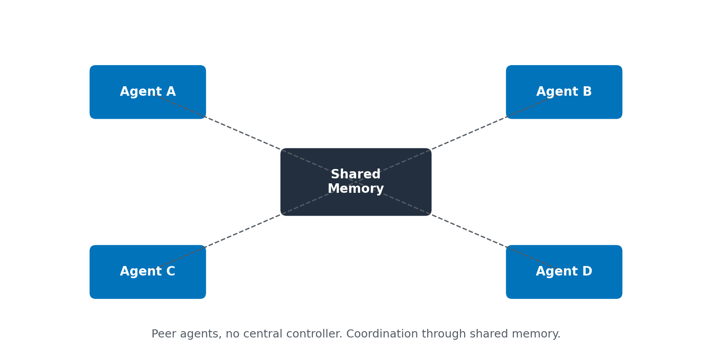

In a broadcast pattern, each agent receives the same input and works independently. A shared memory store (message queue, shared state object, or database) allows agents to read each other's intermediate findings without direct communication. There is no orchestrator deciding what each agent does -- each agent applies its own expertise to the full problem. Results are combined either by a lightweight synthesizer that reads the collected perspectives and produces a unified output, or by presenting multiple viewpoints directly to the user. For example, a code review broadcast sends the same pull request to security, performance, and maintainability agents simultaneously. Each produces an independent assessment. A final synthesis step merges non-overlapping findings and flags contradictions.

### Pattern 6: Graph-based (directed workflow)

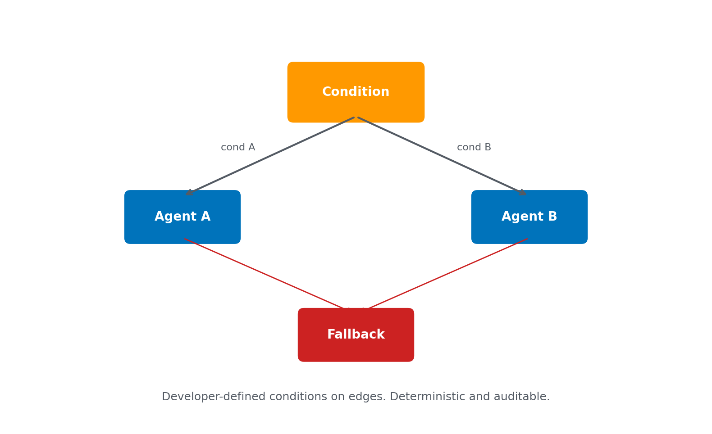

Agents connected in a developer-defined topology with condition nodes that evaluate rules to determine which path to follow. The graph pattern uses developer-defined conditions on edges, making routing explicit, deterministic, and auditable. The hierarchical pattern, by contrast, relies on LLM reasoning to decide routing at runtime.

**Use this when:** You need explicit, auditable control flow with conditional branching that you can unit-test. Your process has well-defined states, transitions, and exit conditions that the developer specifies at design time -- for example, "if quality score < 0.8, loop back to the editing node" or "if approval status is rejected, route to the escalation node." Graph-based patterns are the right choice when you need deterministic routing logic (code-based conditions, not LLM decisions) combined with nodes that may themselves contain agentic behavior. LangGraph and AWS Step Functions follow the graph-based pattern.

**Don't use this when:** Your workflow is simple or sequential in nature, not requiring multi-step reasoning, or retry loops are not required. The graph infrastructure overhead isn't justified for linear pipelines. Also avoid when routing decisions require LLM reasoning rather than evaluable conditions -- use hierarchical instead.

### Pattern 7: Team of agents (role-based collaboration)

In a team pattern, agents collaborate as peers with defined roles, handing off work through structured handoffs. Each team member decides when its work is complete and hands off to the appropriate next member, rather than relying on a central agent for routing decisions. Later roles can hand work back to earlier roles for revision. The revision loop is what a simple pipeline cannot support.

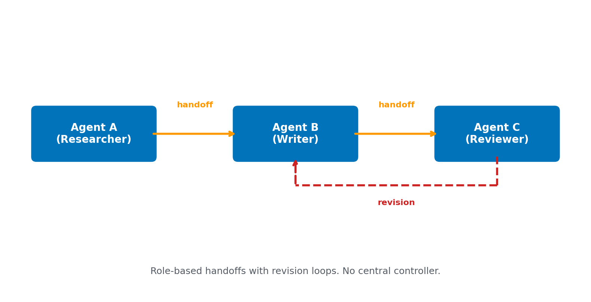

**Use this when:** The task has distinct phases requiring different expertise applied sequentially, and quality benefits from iterative refinement.

**Don't use this when:** The task doesn't benefit from iteration. If the first agent's output is good enough without review, you're paying for unnecessary handoffs. The team pattern's value comes from the ability to hand back (Role C to Role B) for revision, not just forward.

**Trade-offs:**
- Token cost scales with handoffs: each handoff passes accumulated context.
- Quality improves with iteration: the reviewer catches errors the writer missed.
- No central bottleneck: each agent decides when to hand off.
- Risk of infinite loops: without `max_handoffs`, agents could keep sending work back indefinitely.

**Sample use case -- content creation team:**

```python
from strands import Agent
from strands.models import BedrockModel
from strands.multiagent import Swarm

researcher = Agent(
    name="researcher",
    system_prompt="""You are a senior researcher. Gather comprehensive facts and data.
    Structure findings with citations. Hand off to the writer when complete.""",
    model=BedrockModel(model_id="us.amazon.nova-pro-v1:0"),
    tools=[web_search, knowledge_base_retrieval]
)

writer = Agent(
    name="writer",
    system_prompt="""You are a technical writer. Draft a clear, structured document
    from the researcher's findings. Hand off to the reviewer when complete.""",
    model=BedrockModel(model_id="us.amazon.nova-pro-v1:0"),
    tools=[document_formatter, code_validator]
)

reviewer = Agent(
    name="reviewer",
    system_prompt="""You are a senior reviewer. Check for accuracy, clarity, and completeness.
    Hand back to the writer with specific feedback if revisions are needed.
    Approve if the draft meets quality standards.""",
    model=BedrockModel(model_id="us.amazon.nova-pro-v1:0")
)

team = Swarm(
    nodes=[researcher, writer, reviewer],
    max_handoffs=5,
    execution_timeout=600.0,
    node_timeout=120.0
)
result = team("Create a technical brief on Kubernetes cost optimization for AWS EKS")
```

### Pattern 8: Dynamic worker pool (orchestrator-workers)

In a dynamic worker pool pattern, an orchestrator analyzes the task at runtime and determines how many workers of each type to spawn. The worker pool scales the number of agents per role based on the task's actual requirements, whereas the static team pattern fixes roles and team size at design time. A planner first decomposes the work, then the orchestrator spawns N workers of type A and M workers of type B. Workers of the same type execute in parallel, and results are synthesized when the workers complete.

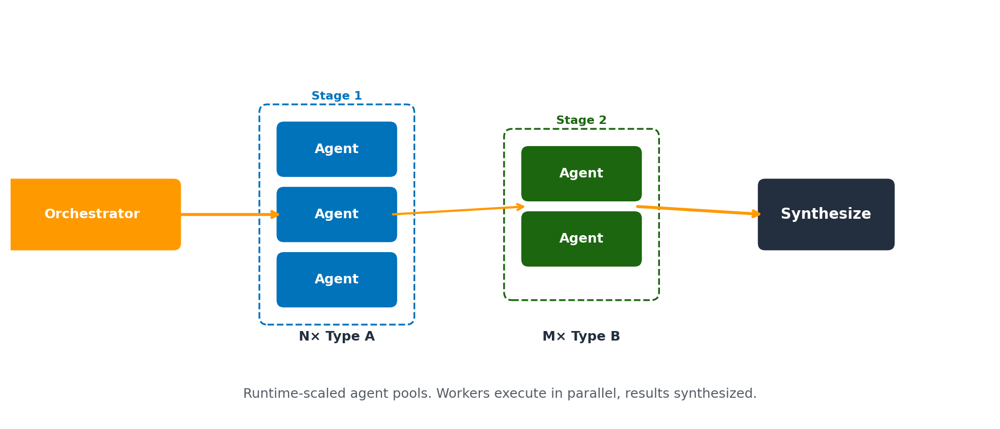

**Use this when:** The number of workers varies per task. A feature request touching 3 files needs 3 coding agents; one touching 10 files needs 10.

**Don't use this when:** The team composition is always the same (use static team instead). Don't use this for tasks where parallelism doesn't help; if workers need to see each other's output before proceeding, sequential or team patterns are better.

**Trade-offs:**
- Token cost scales with the number of spawned workers, plus orchestrator analysis and synthesis overhead.
- Latency equals the slowest worker (parallel execution) plus orchestrator and synthesis overhead.
- Merge conflicts are the primary risk: multiple agents editing overlapping outputs require conflict resolution.
- Requires the orchestrator to accurately decompose the task. Over-spawning wastes tokens; under-spawning misses work.

**Sample use case -- coding agent system:**

```python
from strands import Agent
from strands import tool

@tool
def analyze_task(description: str) -> str:
    """Analyze a feature request and determine team composition."""
    planner = Agent(
        system_prompt="""Analyze the feature request. Determine:
        1. Which files/modules need changes (one coding agent per module)
        2. Which test suites need updates (one QA agent per suite)
        3. Whether security review is needed
        Return a structured plan with agent assignments."""
    )
    return str(planner(description))

@tool
def coding_agent(task: str) -> str:
    """Implement code changes for a specific module."""
    agent = Agent(
        system_prompt="You are a coding specialist. Implement the assigned changes.",
        tools=[file_editor, code_search, linter]
    )
    return str(agent(task))

@tool
def qa_agent(task: str) -> str:
    """Write and run tests for a specific test suite."""
    agent = Agent(
        system_prompt="You are a QA specialist. Write tests and verify correctness.",
        tools=[test_runner, coverage_checker]
    )
    return str(agent(task))

orchestrator = Agent(
    system_prompt="""You are a development team orchestrator.
    1. First, call analyze_task to determine team composition
    2. Spawn the right number of coding_agent calls (one per module)
    3. Spawn qa_agent calls for each test suite
    4. Synthesize results and report the final outcome""",
    tools=[analyze_task, coding_agent, qa_agent]
)
orchestrator("Add OAuth2 authentication to the user API with rate limiting")
```

## From patterns to production: managing tool discovery at scale

The coordination patterns above work well with a handful of agents. But enterprise deployments routinely involve dozens of sub-agents, each with multiple tools, creating a tool surface of hundreds or thousands of capabilities. Loading the full set of tool schemas into the orchestrator's context at startup becomes expensive and degrades reasoning quality. For example, if each tool's JSON schema consumes 2-5 KB of context and your system has 100 tools, the orchestrator may process 200-500 KB of input tokens on every request. Most of those tokens are irrelevant to the current task. The exact numbers vary by system, but the principle holds: as the tool surface grows, upfront loading cost grows with it, and model reasoning quality declines.

**Progressive disclosure** solves this by organizing agent capabilities in three tiers, loading only what the agent needs for the current task:

- **Metadata (always loaded)** -- Skill name, short description, and trigger conditions. The agent starts with a single `find_tools` meta-tool in its context instead of hundreds of full tool schemas.
- **Instructions (loaded on activation)** -- Full procedural knowledge for the skill. When the agent identifies a relevant capability, it loads the complete tool schema on demand.
- **Resources (loaded on execution)** -- Templates, API specifications, and reference data. These exist only within the tool's execution scope and never enter the orchestrator's context.

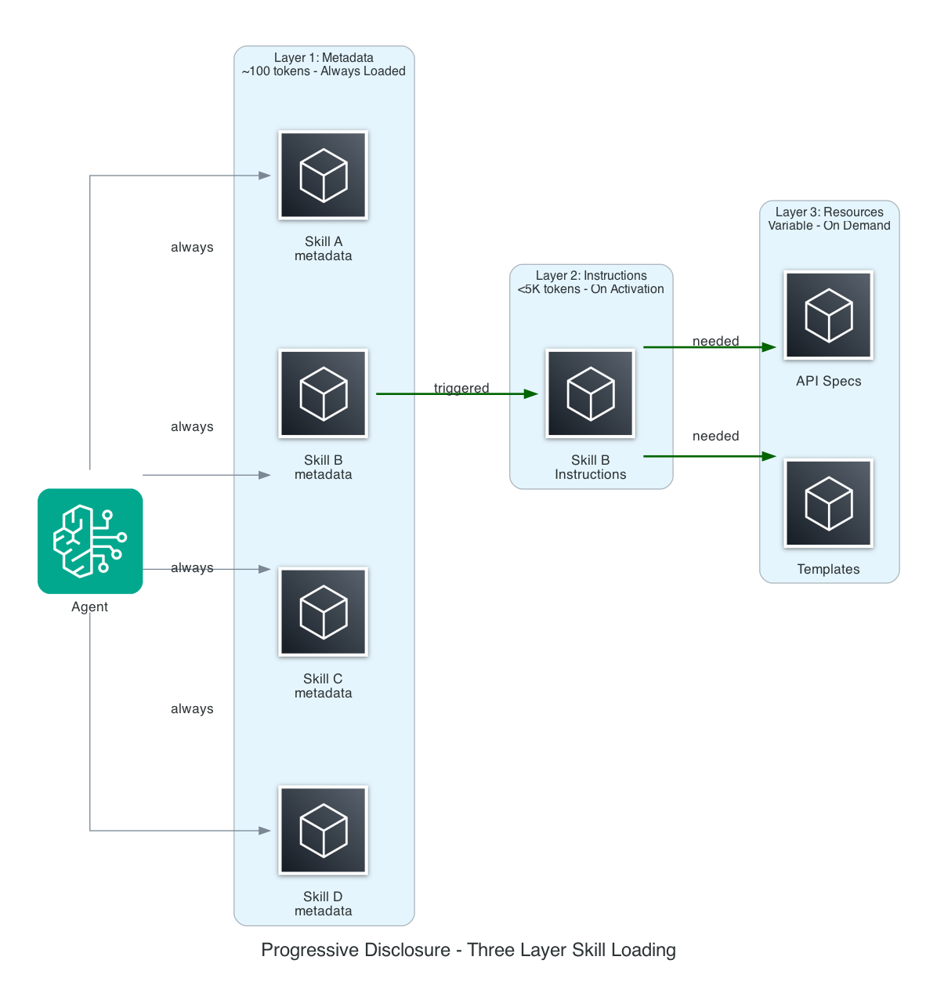
*Figure 3: Progressive disclosure loads tool capabilities in three tiers -- metadata is always present, instructions are loaded on activation, and resources are fetched on demand during execution.*

To see how this works in practice, consider a payroll query hitting an HCM orchestrator that manages more than 30 sub-agents. At startup, the orchestrator's context contains only metadata for each skill -- a name, a one-line description, and trigger conditions. When the user asks "what happens to my pay during parental leave?", the orchestrator's `find_tools` meta-tool matches the query against skill metadata and identifies the payroll skill as relevant. Only then does the orchestrator load the full payroll tool schema -- parameter definitions, API contracts, and procedural instructions. During execution, the payroll tool itself fetches the relevant state tax table from an external data source. That tax data exists only within the tool's execution scope and never enters the orchestrator's context window. The result: the orchestrator reasons over a small, focused context rather than a catalog of every tool in the system.

The key insight is the architectural decision to defer loading. Without progressive disclosure, context size scales linearly with the total number of tools, regardless of what the current request needs. With progressive disclosure, context size scales with the number of tools relevant to the current request -- typically a small fraction of the total. The difference matters for cost (fewer input tokens per request), latency (smaller context means faster inference), and quality. The model reasons better when the context is not diluted with irrelevant schemas.

The principle: don't load what you don't need yet. Implementation approaches fall into two categories:

- **Managed** -- [Amazon Bedrock AgentCore Gateway](https://docs.aws.amazon.com/bedrock-agentcore/latest/devguide/gateway.html) provides runtime semantic tool selection, matching incoming requests to registered tools using built-in semantic search with no infrastructure to manage. [AWS Agent Registry](https://docs.aws.amazon.com/bedrock-agentcore/latest/devguide/registry.html) adds catalog-level governance: a centralized registry for publishing agents, Model Context Protocol (MCP) servers, and tools with approval workflows, versioning, hybrid search (semantic + keyword), and IAM or JSON Web Token (JWT) authorization. Gateway handles the runtime question ("which tool does this request need?"); Registry handles the organizational question ("what tools exist, who owns them, and are they approved for use?").
- **Self-managed** -- Build your own discovery layer using [Amazon OpenSearch Service](https://docs.aws.amazon.com/opensearch-service/latest/developerguide/what-is.html) for vector search over tool descriptions, [Amazon DynamoDB](https://docs.aws.amazon.com/amazondynamodb/latest/developerguide/Introduction.html) or Amazon RDS for a tool registry with custom governance, or [Amazon S3](https://docs.aws.amazon.com/AmazonS3/latest/userguide/Welcome.html) for simple prefix-based tool manifests. Self-managed gives you full control over the discovery mechanism, data model, and retrieval logic at the cost of building and operating the infrastructure.

The following example shows AgentCore Gateway's semantic discovery in practice. Instead of loading tool schemas upfront, the agent uses a single discovery tool to find capabilities at runtime:

```python
import httpx
from strands import Agent
from strands.tools.mcp import MCPClient
from mcp.client.streamable_http import streamable_http_client

mcp_client = MCPClient(
    lambda: streamable_http_client(
        "https://your-gateway-endpoint/mcp",
        http_client=httpx.AsyncClient(
            headers={"Authorization": f"Bearer {access_token}"}
        ),
    )
)

with mcp_client:
    agent = Agent(
        system_prompt="""When you need a capability you don't have,
        use x_amz_bedrock_agentcore_search to find the right tool.""",
        tools=mcp_client.list_tools_sync()
    )
    agent("Process job change: Employee promoted, relocation from TX to CA")
```

A follow-up post explores progressive disclosure implementation patterns in depth, including code examples, benchmarks, and a comparison framework for choosing an approach.

## Practical guidance

- **Start with a single agent.** Move to multi-agent only when you need separation of concerns, parallel execution, or specialized domain expertise.
- **Separate planning from execution.** [ReWOO-style](https://aws.amazon.com/blogs/machine-learning/customize-agent-workflows-with-advanced-orchestration-techniques-using-strands-agents/) plan, execute, synthesize produces more reliable results than monolithic ReAct loops.
- **Instrument everything.** Use OpenTelemetry for distributed tracing across your agent system.

## What's next: where should orchestration live?

The patterns in this post describe how agents collaborate. A separate architectural question emerges at enterprise scale: where does the orchestration logic itself reside? Centralized orchestration (a single supervisor with a registry) provides predictable execution and clear audit trails but creates a bottleneck. Decentralized coordination (peer-to-peer agent mesh) offers horizontal scalability and resilience but makes debugging harder. Most enterprises will adopt a hybrid: centralized governance with distributed execution. A follow-up post explores this trade-off.

## Conclusion

In this post, you learned how to evaluate eight orchestration patterns for multi-agent systems and when to apply each. The foundation patterns (sequential, parallel, router, hierarchical) are well-established building blocks. The advanced patterns (broadcast, graph-based, team-of-agents, dynamic worker pool) address scenarios requiring diverse perspectives, conditional branching, iterative refinement, and runtime-scaled team composition. Progressive disclosure keeps your orchestrator lean as your agent catalog scales. A follow-up post covers implementation patterns in detail. The code examples used the Strands Agents SDK, but the patterns are framework-agnostic.

To get started, explore the [Strands Agents documentation](https://strandsagents.com/) and the [multi-agent collaboration samples](https://github.com/strands-agents/samples) on GitHub. For advanced orchestration techniques including ReWOO and Reflexion patterns, see [Customize agent workflows with Strands Agents](https://aws.amazon.com/blogs/machine-learning/customize-agent-workflows-with-advanced-orchestration-techniques-using-strands-agents/). For the Arbiter and Fabricator patterns for dynamic agent generation, see [Multi Agent Collaboration with Strands](https://aws.amazon.com/blogs/devops/multi-agent-collaboration-with-strands/).

---

*About the authors*

*James Yang is a Principal Solutions Architect at Amazon Web Services.*

*Anjan Dave is a Principal Solutions Architect at Amazon Web Services.*